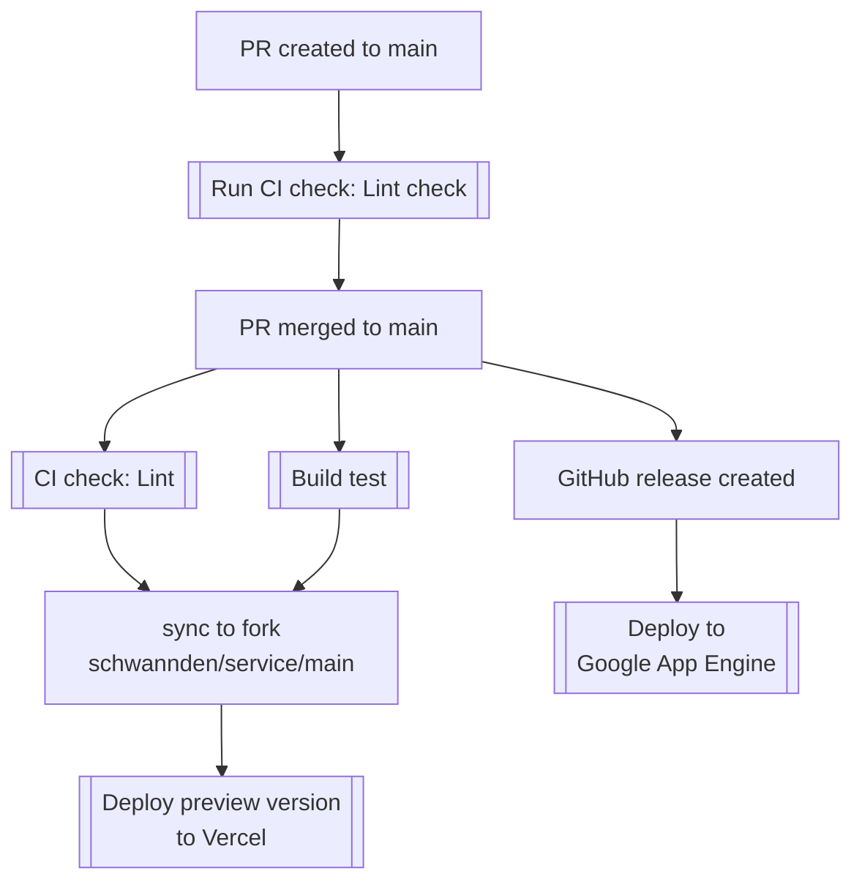

# 萬隆基督的教會服事表

## 開啟專案

安裝相關依賴，開啟開發伺服器

```bash
$ npm install
$ npm run prepare
$ cp .env.template .env.local
# open .env.local and put your google drive token
$ npm run dev
```

Open [http://localhost:3000](http://localhost:3000) with your browser to see the result.

### 年度更新（例：移除 2024、加入 2026）

服務表會同時讀取 `MAIN_SPREAD_SHEET_ID`（當年度）與 `NEXT_YEAR_SPREAD_SHEET_ID`（下一年度）。年底換年度時：

1. 將 `.env` 的 `MAIN_SPREAD_SHEET_ID` 設成 2025 的表單 ID（通常是原本的 `NEXT_YEAR_SPREAD_SHEET_ID` 值）。
2. 將 `.env` 的 `NEXT_YEAR_SPREAD_SHEET_ID` 設成 2026 的表單 ID：`1F8NSEpo2w9TSQMVRrB4mij69wqluljL3Z8jpBaWIsaU`。
3. 重新部署（或在 Vercel/GAE 上更新環境變數後重啟服務），新的 UI 連結與資料就會改讀 2025+2026，不會再載入 2024。

## 目錄結構

```
├─app
│ ├─service # 服事表相關頁面與元件
│ │ ├─_components # 包含服事表邏輯的元件
│ │ ├─_hooks # 包含服事表邏輯的 hooks
│ │ ├─page.tsx # 服事表主頁面
│ ├─layout.tsx # 首頁 Layout
│ ├─globals.css # 全域樣式
│ ├─page.tsx # （首頁）APP 進入點
├─components # 共用元件
│ ├─ui # UI 元件
├─lib # 共用函式庫
│ ├─utils.ts # 工具函式
├─providers # React Context Providers
│ ├─index.tsx # 頂層 providers 進入點
│ ├─query-client-provider.tsx # React Query Provider
├─public # 靜態資源
├─styles # 樣式檔案
├─.github # GitHub 設定
│ ├─workflows # GitHub Actions 工作流程
├─.husky # Husky 設定
├─.vscode # VSCode 設定
├─.eslintrc.js # ESLint 設定
├─.eslintignore # ESLint 忽略檔案
├─.prettierignore # Prettier 忽略檔案
├─next.config.mjs # Next.js 設定檔
├─package.json # npm 套件管理檔案
├─README.md # 專案說明文件
├─tailwind.config.ts # Tailwind CSS 設定檔
├─tsconfig.json # TypeScript 設定檔
```

## 佈署

### 佈署策略



1. 這個專案使用 Google App Engine 作為 production 佈署平台，透過 Github Action 進行自動佈署。
2. 如果要調整 route，需要調整 `dispatch.yaml`，並且手動佈署： `gcloud app deploy dispatch.yaml`。

### 部署

本專案使用 [Please Release](https://github.com/googleapis/release-please) 進行自動部署

1. 手動觸發我們的 [release pipeline](https://github.com/wanlong-church/service/actions/workflows/release.yaml)，點 `run workflow`。
2. 完成以後我們會收到一個release pr，會根據我們上次release到現在的[commit message](https://www.conventionalcommits.org/)覺定發佈版本。
3. 確認沒有問題，merge release pr以後，會自動發佈 [Github Release](https://github.com/wanlong-church/service/releases)。
4. 發佈 [Github Release](https://github.com/wanlong-church/service/releases) 後會自動部署到Google App Engine。

### 監控

1. 使用 Sentry 進行錯誤監控。
2. 所有部署在 Vercel 的版本，Sentry上的release version 都是 preview。
3. 發 Github Release 才是正式版本，在 Sentry 上的版本會使用 package.json 的 version 作為版本名稱。
